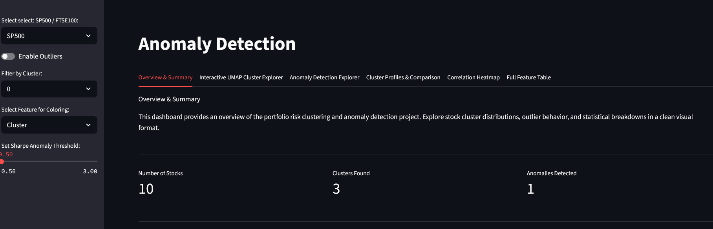
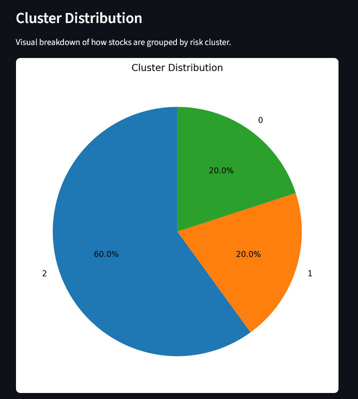
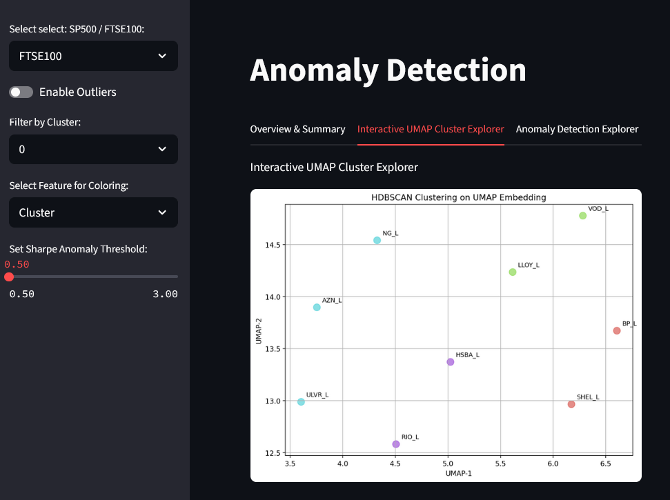
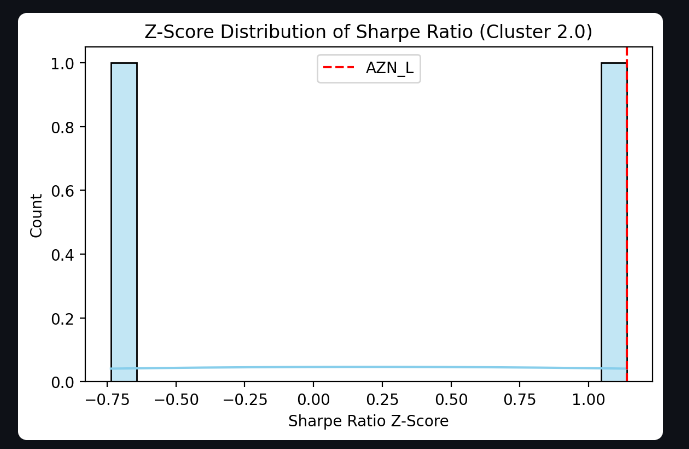
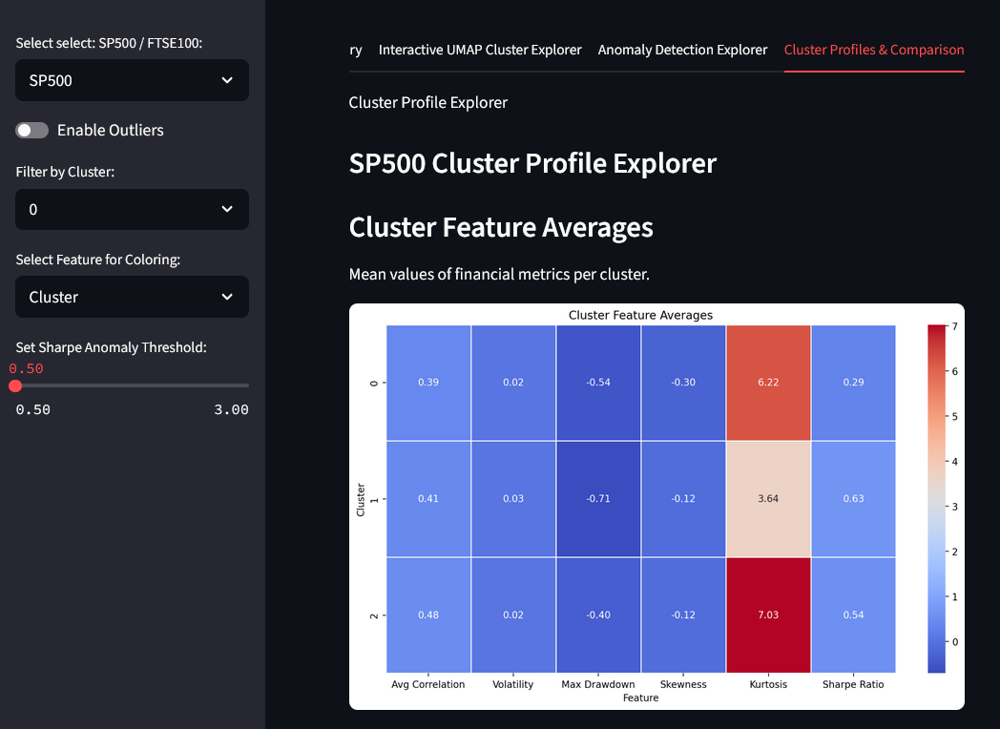

# Portfolio Risk Clustering & Anomaly Detection

Uncovering hidden asset relationships and surfacing abnormal risk behavior using unsupervised machine learning.

---

## Project Overview

This project explores patterns of financial risk by analyzing stocks from the **S&P 500** and **FTSE 100** indices.  
Using dimensionality reduction and unsupervised clustering techniques, we group stocks based on volatility, correlation, and other statistical properties and detect outliers with unusual behavior.

The goal: provide insights for portfolio construction, risk management, and anomaly detection — **now available through an interactive Streamlit dashboard**.

---

## Tools & Libraries

| Layer        | Tools Used                                                  |
|--------------|-------------------------------------------------------------|
| **Data**     | `yfinance`, `pandas`, `numpy`                               |
| **ML**       | `scikit-learn`, `umap-learn`, `hdbscan`, `statsmodels`      |
| **Visuals**  | `matplotlib`, `seaborn`, `Streamlit`                        |
| **Notebook** | `JupyterLab`, `joblib`, `pickle`                            |
| **App**      | `Streamlit`, `Python`                                       |
| **Repo**     | `GitHub`, `Markdown`                                        |

---

## Core Methods

- **Feature Engineering**: log returns, rolling volatility, drawdowns, skewness, kurtosis, Sharpe ratio, correlation
- **Dimensionality Reduction**: PCA, UMAP
- **Clustering**: HDBSCAN
- **Anomaly Detection**: based on Sharpe z-score within clusters
- **Visualization**: cluster scatter plots, heatmaps, anomaly z-scores, interactive breakdowns
---

## Project Structure

```
portfolio-risk-clustering/
│
├── data/
│   ├── raw/                     # Raw OHLCV data (from yfinance)
│   ├── processed/               # Feature summaries and cluster outputs
│
├── notebooks/                  # Exploratory analysis notebooks
│   ├── 1.Data_Retrieval.ipynb
│   ├── 2.Feature_Engineering.ipynb
│   ├── 3.Dimensionality_Reduction_&_Clustering.ipynb
│   └── 4.Insights.ipynb
│
├── scripts/                    # Streamlit dashboard code
│   ├── app.py
│   ├── data_loader.py
│   └── visuals.py
│
├── requirements.txt
├── README.md
└── LICENSE
```


---

## Streamlit Dashboard

A responsive web app for visualizing clustering results, surfacing anomalies, and exploring asset risk metrics interactively.

Main Features:

- **Index Selection**: Switch between S&P 500 and FTSE 100
- **Cluster Summary**: Pie charts, feature distribution per cluster
- **UMAP Visualizer**: 2D projection of risk clusters
- **Anomaly Explorer**: Filter outliers using z-score, inspect feature profile and Sharpe z-distribution
- **Correlation Matrix**: Feature-wise relationships per index
- **Full Feature Table**: Sort and inspect all computed metrics


**Sidebar Filters**

The sidebar lets users toggle between indices (S&P 500 / FTSE 100), enable or disable outliers, filter by cluster, and dynamically adjust the Sharpe Ratio anomaly threshold. These controls update the visuals across the dashboard tabs.

---

## Dashboard Tabs

### 1. **Overview & Summary**
- Project summary and metrics
- Cluster pie chart and anomaly count

Example:




---

### 2. **Interactive UMAP Cluster Explorer**
- Visualize stocks in 2D UMAP space, colored by cluster
- Hover and label tickers for exploration

Example:



---

### 3. **Anomaly Detection Explorer**
- Adjustable z-score threshold to detect Sharpe Ratio anomalies
- Select anomaly to view:
  - Individual feature breakdown (bar chart)
  - Z-score placement in cluster

Example:



---

### 4. **Cluster Profiles & Comparison**
- Heatmap of average metrics per cluster
- Boxplots of feature distributions across clusters

Example:



---

To launch the app:

```
streamlit run scripts/app.py
```

---

## Pipeline Summary

### Phase 1 – Data Collection & Cleaning
- Retrieved 5-year OHLCV data for S&P 500 and FTSE 100 via `yfinance`
- Forward-filled missing values
- Aligned all time series data

### Phase 2 – Feature Engineering
- Calculated log returns, 30-day rolling volatility, drawdowns, correlation, skewness, kurtosis, and Sharpe ratios
- Constructed summary DataFrames for each asset

### Phase 3 – Dimensionality Reduction & Clustering
- PCA applied for linear inspection
- UMAP applied for non-linear projection (n_neighbors=5, min_dist=0.3)
- HDBSCAN used to reveal clusters and outliers
- Visualized clusters with Sharpe ratio overlays and labeled tickers

### Phase 4 – Insights & Outlier Detection
- Identified clusters of high-volatility or negative Sharpe assets
- Isolated HDBSCAN outliers for anomaly labeling
- Compared S&P 500 vs FTSE 100 risk behavior
- Derived conclusions on risk concentration and market dynamics

### Phase 5 – Streamlit App Deployment

- Created multi-tab dashboard with full interactivity
- Enabled data exploration across risk metrics and cluster behavior

---

## Key Insights

### S&P 500
- Clusters reveal common risk profiles (e.g., tech vs energy)
- High outlier rate among biotech and speculative tech stocks

### FTSE 100
- Showed more conservative clustering with tighter Sharpe ratios
- Outliers were mostly isolated financial or commodity-linked companies
- Stronger presence of high-kurtosis assets

---

## How to Use

1. Clone the repository  
2. Create environment and install dependencies:
   ```bash
   pip install -r requirements.txt
   ```
Run notebooks in order:
```
1.Data_Retrieval.ipynb

2.Feature_Engineering.ipynb

3.Dimensionality_Reduction_&_Clustering_of_Portfolio_Risk_Features.ipynb

4.Insights_&_Anomaly_Detection.ipynb
```

## Author

**Georgios Drosogiannis**  
 MSc in Applied Mathematics (NTUA)    
[LinkedIn](https://www.linkedin.com/in/georgios-drosogiannis/)  
[GitHub](https://github.com/George-Dros)

---